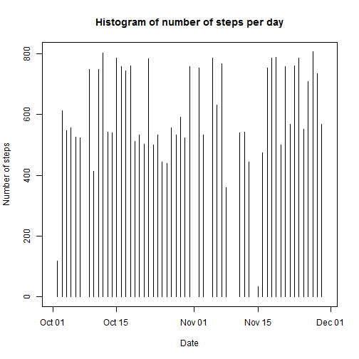
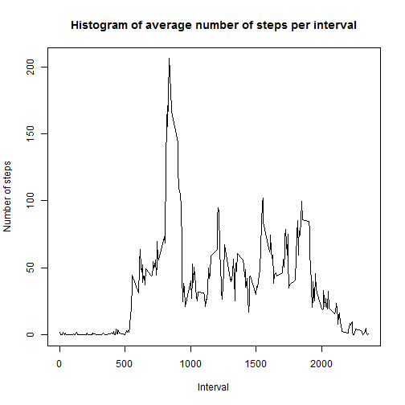
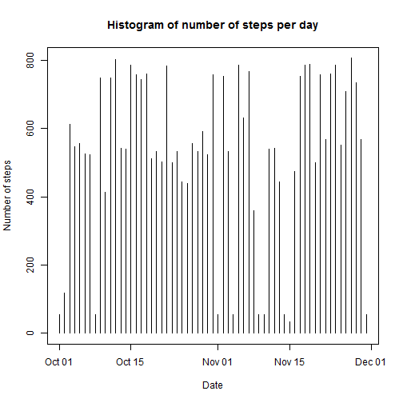
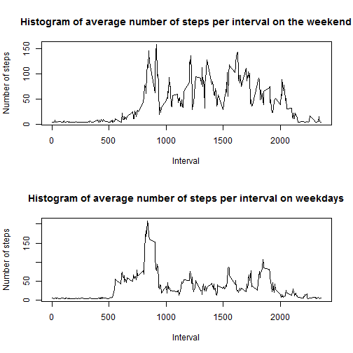

# Reproducible Research: Peer Assessment 1


## Code for loading and preprocessing the data:

```r
setwd("C:/Users/kate/Documents/datascience/coursera")
data<-read.csv("C:/Users/kate/Documents/datascience/coursera/activity.csv")
data$date<-as.Date(data$date)
```

## What is mean total number of steps taken per day?
### Histogram of the total number of steps taken each day:


```r
fig1<-plot(data$date, data$steps, type="h", main="Histogram of number of steps per day", xlab="Date", ylab="Number of steps")
```

 

### The mean total number of steps taken per day:


```r
datanona<-na.omit(data)
dailysum<-rowsum(datanona$steps, datanona$date)
meandailysum<-mean(dailysum)
print(meandailysum)
```

```
## [1] 10766
```


### The median total number of steps taken per day:


```r
mediandailysum<-median(dailysum)
print(mediandailysum)
```

```
## [1] 10765
```


## Histogram of the average daily activity pattern:


```r
intervalmean<-tapply(datanona$steps, datanona$interval, mean)
intervals<-sort(unique(datanona$interval))
fig2<-plot(intervals, intervalmean, type="l", main="Histogram of average number of steps per interval", xlab="Interval", ylab="Number of steps")
```

 

### Interval with maximum daily mean:

```r
x<-which.max(intervalmean)
print(intervals[x])
```

```
## [1] 835
```
## Inputing missing values:
### Number of rows with missing values:

```r
missingvalues<-data[!complete.cases(data),]
nummissing<-nrow(missingvalues)
print(nummissing)
```

```
## [1] 2304
```

### Replacement of missing values using the daily mean values:

```r
dailymean<-tapply(datanona$steps, datanona$date, mean)
dates<-sort(unique(datanona$date))
datadailymean<-data.frame(dailymean, dates)
newdata<-merge(data, datadailymean, by.data="date", by.datadailymean="dates")
newdata$steps[is.na(newdata$steps)] <- newdata$dailymean
```

```
## Warning: number of items to replace is not a multiple of replacement
## length
```
### New data set equal to original data set with missing values filled in:

```r
newdataset<-newdata
newdataset$dates<-NULL
newdataset$dailymean<-NULL
```
###  Histogram of the total number of steps taken each day:

```r
fig3<-plot(newdataset$date, newdataset$steps, type="h", main="Histogram of number of steps per day", xlab="Date", ylab="Number of steps")
```

 
### The mean total number of steps taken per day:

```r
dailysum2<-rowsum(newdataset$steps, newdataset$date)
meandailysum2<-mean(dailysum2)
print(meandailysum2)
```

```
## [1] 571278
```
### The median total number of steps taken per day:

```r
mediandailysum2<-median(dailysum2)
print(mediandailysum2)
```

```
## [1] 571615
```
The mean and median values once the NA values have been imputed are higher than those previously calculated. Therefore it is likely that the NA values skewed the original mean and median calculations.

## Are there differences in activity patterns between weekdays and weekends?
### new factor variable in the dataset with two levels - "weekday" and "weekend":

```r
daysnewdataset<-newdataset
daysnewdataset$day<-weekdays(daysnewdataset$date)
daysnewdataset$weekday<-"weekday"
weekend<-c("Sunday", "Saturday")
daysnewdataset$weekday[daysnewdataset$day %in% weekend] <- "weekend"
```
### panel plot containing a weekend and weekday steps per interval data:

```r
dataweekend<-subset(daysnewdataset, daysnewdataset$weekday=="weekend")
dataweekday<-subset(daysnewdataset, daysnewdataset$weekday=="weekday")

intervalmeanweekend<-tapply(dataweekend$steps, dataweekend$interval, mean)
intervalmeanweekday<-tapply(dataweekday$steps, dataweekday$interval, mean)
intervals<-sort(unique(dataweekend$interval))

par(mfrow=c(2,1))
plot(intervals, intervalmeanweekend, type="l", main="Histogram of average number of steps per interval on the weekend", xlab="Interval", ylab="Number of steps")
plot(intervals, intervalmeanweekday, type="l", main="Histogram of average number of steps per interval on weekdays", xlab="Interval", ylab="Number of steps")
```

 
